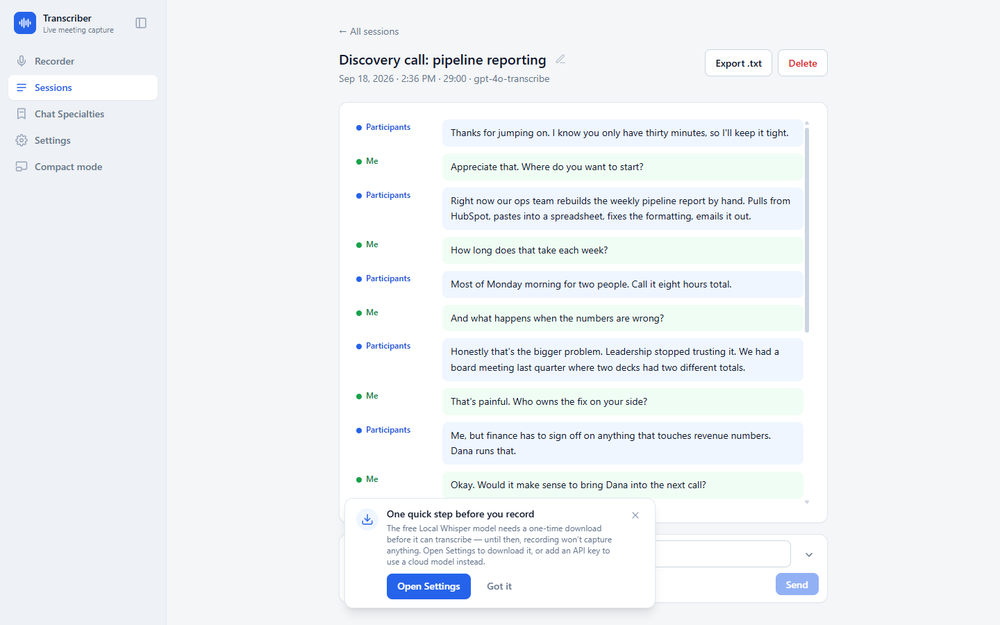
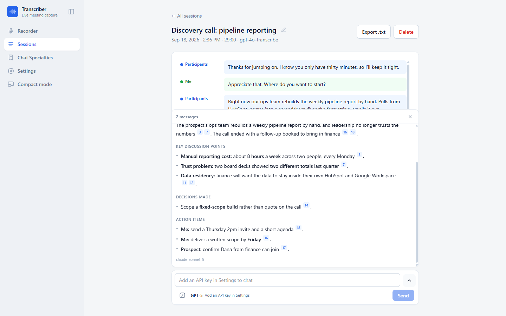
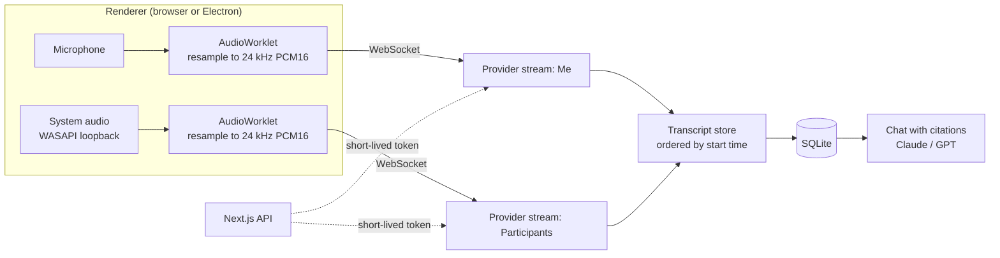

# Meeting Transcriber

**Real-time meeting transcription that knows who said what.** It records your microphone and your computer's audio as two separate streams, transcribes both live, and merges them into one clean transcript labeled `Me:` and `Participants:`. Then you can chat with the transcript and every answer cites the exact lines it came from.

Runs locally as a Windows desktop app (Electron) or in Chrome/Edge. Works with Zoom, Teams, Meet, or anything else that plays audio. Your data stays in a SQLite file on your machine.

Built by **[Alex Brown at Leveled AI](https://leveledai.com)**.

> **Just want to use the app?** You don't need anything on this page. Download the Windows installer from **[leveledai.com/apps](https://leveledai.com/apps)**, run it, and you're recording in a couple of minutes. No coding, no setup, and the free mode doesn't even need an account.



```
Participants: hey, how's it going
Me: good, thanks. Where do you want to start?
```

---

## Why this exists

Most meeting transcribers record one mixed audio stream and then guess at speakers afterwards. That guess is often wrong, and it's wrong exactly when it matters: in a sales call or an interview you need to know which lines were yours.

This app skips the guessing. Your microphone and the system audio are captured as two separate streams, so attribution is known for sure at the moment the audio is recorded. Each stream gets its own live connection to the transcription provider, and the two results are merged into a single timeline.

## Features

- **Two streams, correct attribution.** The mic goes to `Me:` and system audio goes to `Participants:`. The attribution comes from the hardware, not from a model's guess.
- **Three transcription engines behind one interface:**
  - **OpenAI Realtime** (`gpt-4o-transcribe`, `gpt-4o-mini-transcribe`), about 1 s latency
  - **Deepgram** (`nova-3`, `nova-2`), about 300 ms latency, with speaker diarization
  - **Local Whisper** (whisper.cpp): free, offline, no API key. The model downloads on first use.
- **Phone mode.** For a call on speakerphone in the room: records the mic only and splits speakers with Deepgram diarization.
- **Chat with the transcript.** Ask questions of a live or finished meeting using Claude or GPT models. Answers stream in, and every claim links back to the transcript line it came from.
- **Chat Specialties.** Saved system prompts you can reuse on any meeting, and you can write your own. Two ship built in:
  - **Meeting Summarizer**: overview, decisions, action items, each point cited to the transcript.
  - **Sales Call Coach**: finds where the deal stalled, names the real objection behind the words, and writes what to say next. It uses the closing methods popularized by Alex Hormozi: the CLOSER call structure, the value equation, acknowledge-associate-ask objection handling, value stacking, and honest urgency.
- **Compact mode.** A floating always-on-top transcript widget that stays out of the way during a call and remembers where you put it.
- **Desktop app with no capture prompts.** On Windows the Electron build records system audio through WASAPI loopback, so there's no screen-share picker and no "share audio" checkbox. You click Start and both streams are live.
- **Export** any session as `.txt`, or copy it with one click.
- **In-app updates** from GitHub Releases, downloaded only when you ask.



## How it works



A few design decisions worth calling out:

- **No audio relay server.** `POST /api/realtime/token` mints a short-lived token for the active provider, and the browser opens two WebSockets straight to the provider. The real API key never leaves the server, and audio never passes through the app's own backend.
- **One audio pipeline for both streams.** A single 24 kHz `AudioContext` with one `AudioWorkletNode` per source. Each one mixes down to mono, resamples, converts to PCM16, and emits ~100 ms chunks along with RMS levels for the VU meters ([`public/worklets/pcm16-worklet.js`](public/worklets/pcm16-worklet.js)).
- **Ordered merge, not append.** Finished utterances are binary-inserted by `(startedAtMs, seq)`. If one stream lags, its lines still land in the right place ([`src/lib/transcript-store.ts`](src/lib/transcript-store.ts)).
- **Long meetings survive session limits.** Provider connections rotate at about 25 minutes (make-before-break, ahead of OpenAI's 30-minute cap) and reconnect on unexpected drops. A ~3 s ring buffer replays audio to fill the gap.
- **Local Whisper without a streaming model.** Whisper isn't a streaming model, so a small energy-based voice-activity detector buffers audio and sends a window to a local `whisper-server` each time the speaker pauses ([`src/lib/transcription/vad.ts`](src/lib/transcription/vad.ts)).
- **The core has no framework code.** Audio capture, transcription providers and the transcript store don't import React or Next. That's what let the same code move into Electron without a rewrite.

### The desktop wrapper

- The Next.js standalone server runs as an Electron `utilityProcess` on a **free port**, and the window loads `http://127.0.0.1:<port>`. API routes, worklets and `fetch` work unchanged.
- `better-sqlite3` stays compiled for Node in the repo and gets swapped to **Electron's ABI only inside the packaged copy** ([`scripts/package-electron.mjs`](scripts/package-electron.mjs)), so dev and build both keep working.
- A frameless window with custom title-bar controls, a single-instance lock, and a server watchdog that restarts once and then shows an error dialog.

### The release pipeline

Pushing a `vX.Y.Z` tag starts a Windows GitHub Actions job ([`.github/workflows/release.yml`](.github/workflows/release.yml)) that builds the NSIS installer and uploads it to a **draft** release. Then it actually **runs the installer**: install, boot the app and hit `/api/health`, upgrade over itself, uninstall, and check that the directory is gone. The release is published only if that smoke test passes, so a broken build can't reach the updater.

## Getting started

### Requirements

- Windows 10/11 for the desktop app. The browser version needs Chrome or Edge.
- Node.js 22+ (CI uses Node 24).
- At least one of: an OpenAI API key, a Deepgram API key, or nothing at all if you use the free Local Whisper engine.
- Optional: an Anthropic or OpenAI key for chat.

### Run it in the browser

```bash
git clone https://github.com/alexleveled/meeting-transcriber-desktop.git
cd meeting-transcriber-desktop
npm install
npm run dev              # http://localhost:3000 in Chrome or Edge
```

1. Open **Settings**, pick a transcription provider, paste its key, click **Test key**, then **Save**. Keys are stored in the local SQLite database, so you only enter them once. To skip keys entirely, run `npm run fetch-whisper` once (it downloads the Windows whisper.cpp binaries), then choose **Local Whisper** in Settings and download a model.
2. Open **Recorder** and click **Start recording**. Allow the mic. In the screen-share dialog pick **Entire screen** and tick **Also share system audio**.
3. **Use headphones.** Without them your mic also picks up the other people, and their words get labeled `Me:`.
4. Click **Stop** to finish. The meeting is saved under **Sessions**.

### Run it as a desktop app

```bash
npm run dev:electron     # Next dev server + Electron window, with hot reload
npm run dist             # production NSIS installer in dist-electron/
```

`npm run dist` fetches the whisper.cpp binaries, generates the icon, bundles the Electron main process with esbuild, builds Next in standalone mode, swaps the SQLite binary to Electron's ABI, and packages the installer. The installed app keeps its database under `%APPDATA%\meeting-transcriber\data\`.

### Environment variables (optional)

Keys normally live in the Settings page. Env vars are only a fallback. Copy `.env.local.example` to `.env.local` if you'd rather use them:

| Variable | Purpose |
|---|---|
| `OPENAI_API_KEY` | OpenAI Realtime transcription and GPT chat |
| `DEEPGRAM_API_KEY` | Deepgram transcription |
| `ANTHROPIC_API_KEY` | Claude chat |
| `TRANSCRIBER_DB_PATH` | Where the SQLite file lives (default `data/transcriber.db`) |

## Provider cost at a glance

| Provider | Models | Latency | Approx. cost per meeting hour (2 streams) |
|---|---|---|---|
| OpenAI Realtime | `gpt-4o-transcribe` / `gpt-4o-mini-transcribe` | ~1 s | ~$0.72 / ~$0.36 |
| Deepgram | `nova-3`, `nova-2` | ~300 ms | ~$0.92 |
| Local Whisper | `ggml-small.en` and others | a few seconds, runs after each pause | $0 |

## Project layout

```
src/
  app/            Recorder, Sessions, Specialties, Settings pages + API routes
  components/     RecorderProvider, CompactWidget, TranscriptList, chat UI, VU meters
  hooks/          useRecorder, useChat, useUpdates
  lib/
    audio/        capture sources + the PCM pipeline
    transcription/ openai-realtime, deepgram, local-whisper, VAD, provider factory
    recorder-engine.ts, transcript-store.ts   (no React/Next imports)
  server/         SQLite schema + queries, settings, chat providers, whisper.cpp manager
electron/         main, preload, server fork, loopback capture, compact window, updater
scripts/          packaging, release, installer smoke test, whisper fetch, icon generation
public/worklets/  pcm16-worklet.js
```

`/debug` is an unlinked diagnostic page that tests mic and system capture (VU meters and chunk counters) without any transcription provider. Handy for checking that screen-share audio is actually coming through.

## Tech stack

Next.js 15 · React 19 · TypeScript · Tailwind CSS · better-sqlite3 · Web Audio API / AudioWorklet · Electron · esbuild · electron-builder (NSIS) · electron-updater · whisper.cpp · OpenAI Realtime · Deepgram · Anthropic SDK · GitHub Actions

## Notes and limits

- The browser version can only capture system audio when you share the **entire screen** with the audio box ticked. The desktop app doesn't have this limitation.
- API keys sit unencrypted in the local SQLite file, the same exposure as a `.env` file. That's acceptable for a single-user local app. Electron's `safeStorage` is the next step if that changes.
- The installer isn't code-signed, so Windows SmartScreen will warn on first install.

## About the author

I'm Alex Brown. I build AI systems that plug into how a business already works: transcription, agents, automations, and the plumbing that makes them reliable.

- Website: **[leveledai.com](https://leveledai.com)**
- More work: [github.com/alexleveled](https://github.com/alexleveled)

If you want something like this built for your team, [get in touch through leveledai.com](https://leveledai.com).

## License

[MIT](LICENSE)
